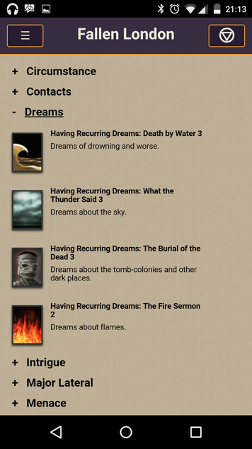
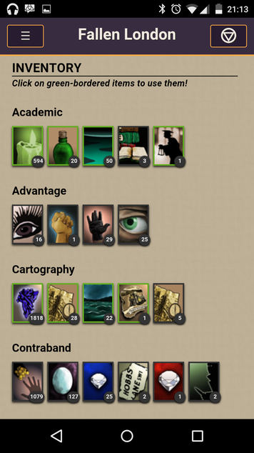
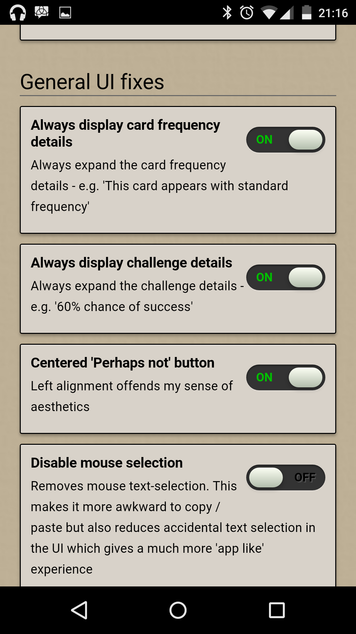
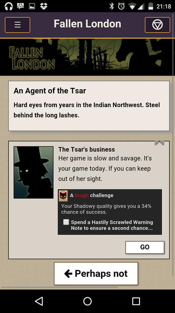
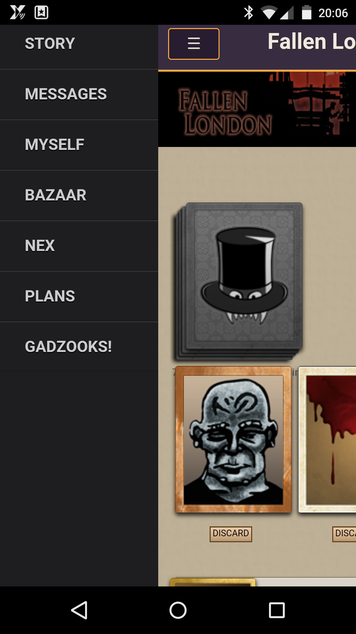
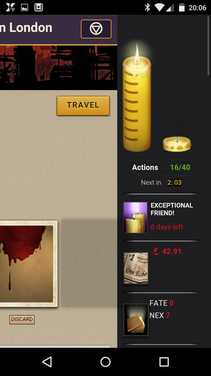

**NOTE: THIS ADDON IS NOW ARCHIVED**
Fallen London has fixed most of the issues that this addon set out to address. Go [enjoy the game](http://fallenlondon.storynexus.com) as it was meant to be.

---

A miscellany of adornments, accoutrements and other such trappings to the popular [Fallen London](http://fallenlondon.storynexus.com) browser game.

Gadzooks! is in no way associated with Failbetter games. Use of this browser script is entirely at your own risk.

Here be dragons, and so forth.

Random Screenshots
------------------
The following show the 'Mobile' zook when its enabled on an Android device:

More previews can be found in the [screenshots directory](docs/screenshots).

Install via Greasemonkey
-----------------------------
1. Download GreaseMonkey for your preferred browser:
	* **Chrome** - [TamperMonkey](https://chrome.google.com/webstore/detail/tampermonkey/dhdgffkkebhmkfjojejmpbldmpobfkfo)
	* **Firefox** - [GreaseMonkey](https://addons.mozilla.org/en-US/firefox/addon/greasemonkey/)
	* **Opera** [via JavaScript files](http://www.ghacks.net/2008/08/10/greasemonkey-in-opera/)
	* **Safari** [via hacks](http://www.simplehelp.net/2007/11/14/how-to-run-greasemonkey-scripts-in-safari/)
2. Install the script by [clicking here](https://github.com/hash-bang/gadzooks/raw/master/gadzooks.greasemonkey.user.js)
3. Visit the [Fallen London](http://fallenlondon.storynexus.com) website
4. Configure Gadzooks! By default a new tab should be created allowing access to the Gadzooks! options screen, you can also access Gadzooks! via the link in the the top right of your screen next to your login name or you can press F12.

Install via bookmarklet
-----------------------
1. Create a new bookmarklet with the URL `javascript:$('body').append('')`
2. Visit the [Fallen London](http://fallenlondon.storynexus.com) website
3. Open the bookmarklet - while the FL page is open, do not open another tab or window first
4. Configure Gadzooks! By default a new tab should be created allowing access to the Gadzooks! options screen, you can also access Gadzooks! via the link in the the top right of your screen next to your login name or you can press F12.

Install on your phone
---------------------
This feature is very very much experimental.

1. Open your favourite browser - Chrome is recommended on Android
2. Create a bookmark with the following URL: `javascript:$('body').append('')`
3. Visit the [Fallen London](http://fallenlondon.storynexus.com) website in the browser
4. Open the above bookmark - Gadzooks should now load. If you keep the page open in your browser Gadzooks! should remain loaded when switching to another app
5. Configure Gadzooks! By default a new tab should be created allowing access to the Gadzooks! options screen, you can also access Gadzooks! via the link in the the top right of your screen next to your login name or you can press F12.

See the [Troubleshooting](#troubleshooting) if you get yourself into a pickle.

What Gadzooks! Does
===================
Gadzooks! provides a series of browser injections in a manageable, modular way.
It was originally written because I felt that the lack of mobile support for Fallen London is severely lacking and could be rectified with a few CSS hacks. However some of the changes I made might not be to everyones liking so I started to split them up into optional modules.

Gadzooks! has a number of supported 'Zooks' which can provide functionality anywhere from CSS fixes to full JavaScript patching.

FAQ
===
**Does Gadzooks! work on mobile devices?**

Absolutely. Use the same technique to load Gadzooks! via a bookmarklet and you get a fancy almost-an-app experience. See the [Install on your phone](#install-on-your-phone) section for more information.

**Is there any support for Gadzooks?**

In a way yes. If you have noticed an error please [create a ticket](https://github.com/hash-bang/gadzooks/issues) on the Gadzooks! GitHub page. **DO NOT** bother Failbetter games about this. We are in no way affiliated with the original creators of FL and them receiving complaints about our module will probably end up in someone getting mad at us.

**Why 'Gadzooks'?**

Its a shortened version of 'Gods Hooks' (the nails from the crucifixion). Since it hooks into an existing game the pun was too much to resist.

**Can I cheat using Gadzooks?**

No. FL is *mostly* server based. Its not possible to alter the state of your character, inventory or anything like that without going though the server. Gadzooks! provides only a plesent sheen on top of the existing game.

**I have a great idea for a new Zook (a plugin)**

Thats great! File it in the [issue tracker](https://github.com/hash-bang/gadzooks/issues) as a suggestion and we'll see what we can do.

You may also wish to check out the [zook tips](zooks.md) for some tips on writing Zooks.

**I have some programming ability and wish to help**

Again, great. Either fork the [original repo](https://github.com/hash-bang/gadzooks) and [create a pull request](https://help.github.com/articles/creating-a-pull-request) for whatever you come up with so everyone can benefit.

**I am a designer and wish to help**

Yey!

My design skills suck. Any help you can offer, especially with the mobile Zook would be very much appreciated.

Create a post in the [issue tracker](https://github.com/hash-bang/gadzooks/issues) about how you can help.

**Does Gadzooks! do anything perminant?**

No. Gadzooks! is a *temporary* set of hacks that gets injected into the web page only when you permit it to load. A simple page refresh will set everything back to normal.

**Does Gadzooks! do anything bad?**

The only major thing Gadzooks! could be said to do that could be considered 'bad' is that it disables the help system for FL. We do this so people do not bother Failbetter with complaints which may be the fault of Gadzooks!

**I want to help!**

Yey! Fork the [repo](https://github.com/hash-bang/gadzooks) and submit a pull-request when you have something working. Many hands, light work and so on.

**Why don't you use GitHub.io to host?**

Unfortunately GitHub.io does not provide access for [CORS](https://en.wikipedia.org/wiki/Cross-origin_resource_sharing) enabled sites. We have to use a work-around domain to make everything load correctly.

**Who are you?**

My name is [Matt Carter](https://github.com/hash-bang) and I'm a senior developer at [Mom's Friendly Development Company](http://mfdc.biz), occasional lecturer and collector of rats-on-strings.

Within FL I go by the username `Cac0nym`.

Troubleshooting
===============

**I can't get this working with Android Chrome**

For some demented reason Chrome doesn't accept JavaScript bookmarks if 'Merge tabs and apps' if Off in settings. Try setting that to 'On' and reloading.

**Pages are all screwed up / styles are b0rked / things break when I do 'X'**

Dang. I do try to test these things but the original game is a nest of weird code and styles. This is not helped by adding more and more hacks on top of that.

Please file a [bug report](https://github.com/hash-bang/gadzooks/issues) giving a few brief descriptions on whats screwed up and possibly a screen shot. I'll try and look at it when I can.

**Something has gone wrong that isn't covered here**

Please file a [bug report](https://github.com/hash-bang/gadzooks/issues) giving a few brief descriptions on whats screwed up and possibly a screen shot. I'll try and look at it when I can.
